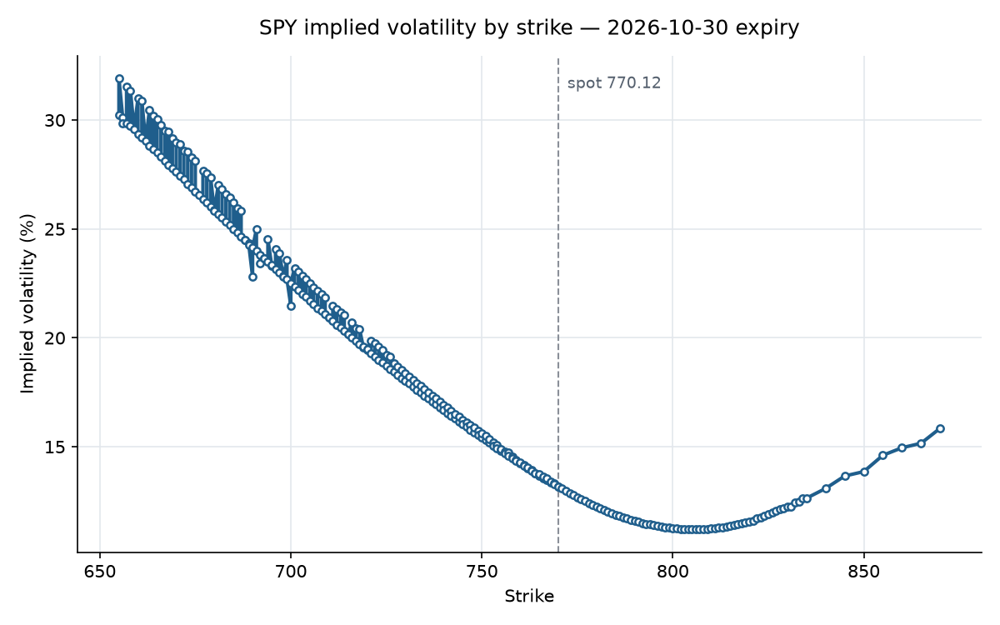

# Black-Scholes Options Pricer

A from-scratch implementation of European option pricing in Python: the closed-form
Black-Scholes formula, all five Greeks, a Newton-Raphson implied volatility solver,
a Monte Carlo pricer, and a pipeline that pulls live option chains and plots the
volatility smile.



The chart above is real SPY option data. If Black-Scholes held exactly, it would be a
flat line — every strike would imply the same volatility. Instead implied vol rises
steeply toward lower strikes, which is the market pricing crash risk that a lognormal
model does not allow for.

## What's in it

| Module | What it does |
|---|---|
| `pricing.py` | Closed-form Black-Scholes price for European calls and puts |
| `greeks.py` | Delta, gamma, vega, theta, rho |
| `implied_vol.py` | Newton-Raphson solver that inverts the pricing formula for sigma |
| `monte_carlo.py` | Risk-neutral Monte Carlo pricer, vectorized with numpy |
| `data.py` | Option chain fetching, liquidity filtering, parity-implied spot, OTM chain construction |
| `plotting.py` | Volatility smile chart |

## Setup

```bash
git clone https://github.com/ADAMIN15/black-scholes-pricer.git
cd black-scholes-pricer
python3 -m venv venv && source venv/bin/activate
pip install -r requirements.txt
```

## Usage

Price an option and get its Greeks:

```python
from src.bs_pricer.pricing import bs_price
from src.bs_pricer.greeks import delta, vega

bs_price(100, 100, 1, 0.05, 0.2)        # 10.4506
delta(100, 100, 1, 0.05, 0.2)           # 0.6368
vega(100, 100, 1, 0.05, 0.2)            # 37.5240
```

Back out implied volatility from a market price:

```python
from src.bs_pricer.implied_vol import implied_vol

implied_vol(10.4506, 100, 100, 1, 0.05)  # 0.2000
```

Build and plot a volatility smile from live data:

```python
from src.bs_pricer.data import fetch_chain, implied_spot, build_otm, compute_smile
from src.bs_pricer.plotting import plot_smile

spot, expiry, T, calls, puts = fetch_chain("SPY")
s_eff = implied_spot(calls, puts, spot, T)
otm = build_otm(calls, puts, s_eff)
strikes, ivs = compute_smile(otm, s_eff, T)
plot_smile(strikes, ivs, s_eff, expiry)
```

## Tests

```bash
pytest -q
```

20 tests covering known values, put-call parity, the delta identity, round-tripping
the IV solver across strikes, Monte Carlo convergence to the closed form, and the
error paths.

## Assumptions and limitations

- **Risk-free rate is hardcoded at 4%.** Not fetched from the curve, and not
  term-matched to each expiry.
- **Dividend yield defaults to zero.** The parity-implied spot absorbs most of the
  dividend effect for index options, but `q` is not estimated directly.
- **European exercise only.** SPY options are American; early exercise is not modeled.
- **Newton-Raphson can fail on deep in-the-money contracts,** where vega approaches
  zero and the iteration diverges. Those contracts are skipped rather than solved.
  Building the smile from out-of-the-money options avoids the problem in practice.
- **Market data comes from `yfinance`,** which carries stale quotes and gaps. The
  cleaning step filters for two-sided quotes, non-zero volume or open interest, and
  bid-ask spreads under 50% of mid.